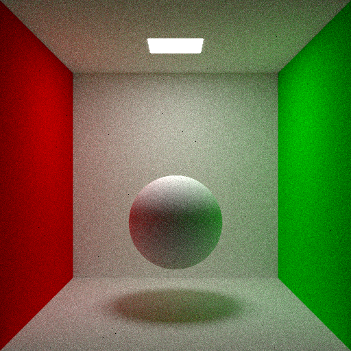

# Path Tracer

A physically-based path tracer built from scratch in C++ to learn rendering theory and build a foundation for advanced path tracing techniques and graphics research.




## Overview

An unidirectional Monte Carlo path tracer implementing the rendering equation. The goal of this project is to build a solid foundational knowledge before moving towards advanced path tracing techniques and graphics research.


## Features

- **Monte Carlo path tracing**
Each pixel color is estimated by averaging many randomly sampled light paths. The estimation is probabilistically complete, and given enough samples it will converge to the true solution of the rendering equation. Ray depth is fixed to limit the number of light bounces.

- **Diffuse (Lambertian) materials**
Surfaces scatter incoming light uniformly across the hemisphere. Bounce directions are sampled randomly in the hemisphere aligned to the surface normal. Emissive materials act as area lights, contributing direct radiance along sampled paths.

- **Multi-sample anti-aliasing**
Each pixel fires multiple rays with sub-pixel jitter and averages the results, resolving edge aliasing and reducing variance simultaneously.

- **Multi-threaded rendering**
Pixel rows are distributed across threads via OpenMP, improving render throughput.


## Build and run

```
cmake -Bbuild -GNinja
cmake --build build -t run
```

Requires a C++17 compiler and OpenMP. Resolution and sample count are configured in `src/main.cpp`.


## Gallery

TBD


## Roadmap

**Materials & light transport**
- Cosine-weighted hemisphere sampling (proper Lambertian PDF, variance reduction)
- Mirror reflection and metallic materials (probabilistic BRDF lobe selection)
- Glass / dielectrics (Snell's law, Fresnel equations, total internal reflection)
- Multiple importance sampling (MIS) — combining BRDF and light sampling
- GGX microfacet BRDF (physically-based roughness model)

**Scene & acceleration**
- Bounding volume hierarchy (BVH) for sublinear ray-object intersection
- Triangle mesh loading (OBJ)
- HDR environment maps / image-based lighting

**Advanced**
- Volumetric rendering / participating media
- Subsurface scattering
- Caustics
